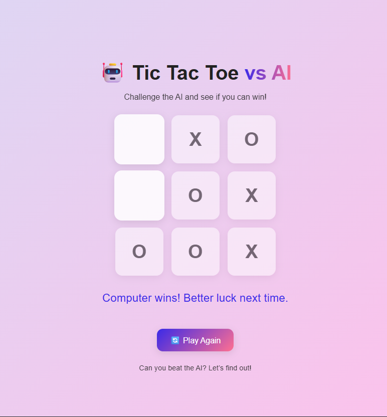

# 🎮 Tic Tac Toe — Advanced Continuous Mode

A modern and **unique version** of the classic Tic-Tac-Toe game, built using **HTML, CSS, and JavaScript**.  
Unlike traditional Tic-Tac-Toe games that end after 9 moves or a draw, this version continues **indefinitely** until one player wins — giving it a fresh, strategic twist.

---
## 🚀 Live Demo

Play it online now on **Vercel**:  
👉 [https://your-vercel-link.vercel.app](https://your-vercel-link.vercel.app)

---

## 🧠 What Makes This Game Special

This isn’t your ordinary Tic-Tac-Toe.

✨ **Continuous Play Mode**  
The game keeps going even after all 9 cells are filled — no draws here. The game continues until one player (human or AI) finally wins.

🌀 **Piece Rotation System**  
Each player (you and the AI) can only have **3 active pieces** on the board at any time.  
After you place your 4th piece, your **oldest piece disappears**, forcing you to think strategically.

⚔️ **Dynamic Challenge**  
Because pieces keep disappearing and reappearing, you can never relax — one mistake could instantly give your opponent the win.

🤖 **Smart AI**  
The AI analyzes the board each turn:
- Tries to **win immediately** if possible.  
- Blocks the player’s **winning moves**.  
- Chooses a **random safe move** otherwise.

---
## 🎮 Game Screenshot



---
## 🕹️ How to Play

1. link ()
2. You play as **X**, and the computer plays as **O**.  
3. Take turns placing your pieces.  
4. After your third move, your **oldest X** will disappear automatically on your next turn.  
5. The game continues until **either you or the computer gets three in a row**.


## 🧩 Features Breakdown

| Feature | Description |
|----------|-------------|
| **Smart AI** | Uses simple logic to win or block the player. |
| **Piece Limit (3 Max)** | Keeps only 3 of your latest moves on the board. |
| **Continuous Gameplay** | Never ends in a tie — play continues until a winner emerges. |
| **Reset Button** | Instantly restart the game anytime. |
| **Clean UI** | Simple and responsive layout. |


## 🧱 Project Structure
> index.html # Main game page  
> css/ # Styling folder   
 - style.css  
>js/ # Game logic  
  - main.js  
> explan_1.txt # Detailed logic explanation  
  explan_2.txt # Extra notes  


---

## 💡 Behind the Scenes

This version introduces a **rotational gameplay mechanic** — every time a player places a fourth piece, their **first piece disappears**, similar to "moving pieces" in strategy games like checkers.

That means:
- The board is always in motion.
- Winning requires **planning ahead**.
- You can **lose your advantage** if you’re not careful with positioning.

---

## 🧑‍💻 Technical Summary

- Built entirely with **Vanilla JavaScript** — no libraries or frameworks.
- Game logic organized inside the `TicTacToe` class.
- DOM-based rendering with dynamic updates after every move.
- Real-time turn tracking and winner detection.

---

## 🚀 How to Run Locally

```bash
# Clone the repo
git clone https://github.com/yourusername/tic-tac-toe.git

# Go into the project folder
cd tic-tac-toe

# Run with Python (optional)
python3 -m http.server 5500

# Visit
http://localhost:5500
```

## 🧑‍💻 Developer

Developed by **Fadel Mohammad**  
A modern reinterpretation of Tic Tac Toe — combining strategy, persistence, and creativity.

---


## 🏁 Summary

This project redefines the classic Tic Tac Toe experience with **continuous gameplay** and a **smart AI opponent**.  
It's simple, fast, and addictive — a battle of logic that never ends until someone truly loses.

---